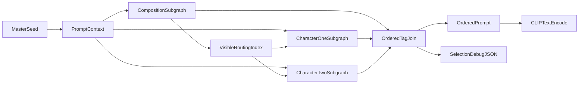

# Dynamic Prompt Engine

## Approach
Build editable ComfyUI subgraphs from small generic utility nodes rather than a deeply nested Impact Pack wildcard string or a monolithic form node. `ImpactWildcardProcessor` resolves its wildcards during queue preprocessing and cannot safely consume strings assembled by upstream execution nodes. A single `PROMPT_CONTEXT` bus will carry the master seed through each module; pool nodes derive deterministic, independent local RNG streams from that context and their stable keys. This removes the need to fan out a seed wire to every pool.

## Modular utility contracts
- Implement only generic custom nodes in the local ComfyUI `custom_nodes` directory and register them through `NODE_CLASS_MAPPINGS` / `NODE_DISPLAY_NAME_MAPPINGS`:
  - `PromptContext`: accepts the master seed and outputs the custom `PROMPT_CONTEXT` type. It owns run-level metadata and trace collection.
  - `SeededTextPool`: accepts a `PROMPT_CONTEXT`, a stable `stream_key` widget, and a multiline library (one candidate per line). It derives `hash(master_seed, stream_key)` internally and outputs the chosen text, choice index, and pass-through `PROMPT_CONTEXT`.
  - `TextPoolRouter`: accepts `PROMPT_CONTEXT`, a selection index, and multiple connected text-pool inputs; outputs the chosen text and pass-through context. It has no fixed profiles or hard-coded prompt categories.
  - `TagJoin`: joins connected tag strings in visible input order, omits empty values, appends selection metadata to the context trace, and returns the final `STRING` plus debug JSON.
- Let each vocabulary category use an independently editable multiline `SeededTextPool`. This preserves full Cartesian permutation space and keeps every run local, reliable, and reproducible.
- Use the output index from any composition/action/interactions pool as an explicit, visible routing signal. Wire it to whichever `TextPoolRouter` instances should select alternate source pools. Advanced users can add arbitrary pools, routers, branches, and constraints without changing utility-node schemas.
- Use one context wire per major subgraph. Within a module, chain each utility's pass-through context output into the next utility's context input, using reroutes where helpful. Tag text outputs can branch independently to `TagJoin`; no seed fan-out is needed.

## Subgraph layout
- Assemble the generic utilities into an editable top-level `Dynamic Prompt Engine` subgraph, with nested reusable subgraphs for:
  - `01 · Quality / meta / rating`
  - `02 · Composition`: person count, action/interaction, pose, hand position, leg position, camera distance, camera angle
  - `03 · Character 1`: identity/artist, hair colour, hair length, hair style, eyes, expression, body, clothing, underwear, accessories
  - `04 · Character 2`: the same visible structure, gated by a count-aware routing branch
  - `05 · Scene`: background, objects, lighting, effects
- Keep all library widgets inside their respective subgraph rather than exposing a fixed outer form. Double-clicking any subgraph reveals and permits modification of every pool and connection.
- Join the outputs in this fixed order:
  1. Quality/meta/rating
  2. Character count → interaction/action → pose → hands → legs → camera
  3. Character 1 top-to-bottom descriptors
  4. Character 2 top-to-bottom descriptors, selected only for a two-character composition
  5. Background → objects → lighting → effects
- The count selector will be authoritative: one-character mode omits character two; two-character mode selects only compatible interaction entries.
- Return two outputs: the final `STRING` prompt and a `STRING` debug JSON document with every selected entry, selected index, derived seed, and final text.

## Files and validation
- Preserve the current workflow as-is: `dynamic_prompt.json` and `dynamic_prompt_api.json`.
- Add the generic utility-node package under ComfyUI's `custom_nodes` directory and a new UI-format workflow, `dynamic_prompt_engine.json`, plus its runnable API-format counterpart, `dynamic_prompt_engine_api.json`.
- Validate that the utility nodes are imported and reported by the local `http://localhost:8188/object_info` registry after restarting ComfyUI. Confirm the local frontend's subgraph support before composing nested modules.
- Queue fixed-seed and changed-seed test runs, verify the generated prompt always follows the intended block order, verify one-character runs omit character two, and record the populated prompt alongside the saved image metadata. Verify that adding a new pool or changing one pool's `stream_key` does not change selections from unrelated pools.

## MCP role
Use the local ComfyUI MCP connection to inspect utility-node schemas, add or modify pools, create visible routing connections, change the master seed/batch parameters, run the workflow, and compare emitted debug metadata. The graph owns the dependency logic; the MCP agent can safely extend it without rewriting a monolithic node or nested prompt template.