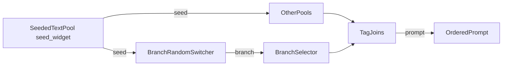

# Branch Random Switcher & Branch Selector Implementation Plan (corrected)

> **For agentic workers:** REQUIRED SUB-SKILL: Use superpowers:subagent-driven-development (recommended) or superpowers:executing-plans to implement this plan task-by-task. Steps use checkbox (`- [ ]`) syntax for tracking.

**Goal:** Replace the composition-specific `BranchToggle`/`FirstOrMerge`/`FirstOrSecond` nodes with two generic nodes: a seeded `BranchRandomSwitcher` (up to 15 dynamic inputs) and an N-way `BranchSelector`, and strip all `girl`/composition wording from the codebase.

**Architecture:** Keep the existing `FlexibleOptionalInputType` + `derive_stream_seed` + `join_prompt_parts` helpers. `BranchRandomSwitcher` derives its branch from the set of *wired* `branch_N` inputs (0 → random 0/1 with empty text, 1 → that input, 2+ → seeded pick). `BranchSelector` reads an integer `branch` and returns `input_{branch}`. The JS layer reuses the TagJoin dynamic-socket machinery with new `branch_`/`input_` prefixes and a 15-slot cap.

**Tech Stack:** Python 3 (stdlib + `torch` for the unrelated `ResolutionSwitch`), ComfyUI custom-node API, LiteGraph JS extension.

**Spec:** Inline (requirements captured in Goal and Global Constraints).

---

## Environment & path conventions (read first)

- The repo root **is** the `dynamic_prompt_engine` package (flattened). Files live at the repo root: `prompt_engine_nodes.py`, `__init__.py`, `resolution_node.py`, `test_branch_toggle_unique_id.py`, `web/dynamic_prompt_engine.js`, `README.md`. There is **no** nested `dynamic_prompt_engine/` directory.
- **Filesystem paths** (in `Files:` sections, `git add/mv/rm`, and `grep`) are repo-root-relative and do **not** carry a `dynamic_prompt_engine/` prefix.
- **Python import statements** use the module path `from dynamic_prompt_engine.prompt_engine_nodes import ...` — this is the package name (correct as written in the snippets below), not a filesystem path.
- **Test commands** run with `python3` (not `python`) from the repo **parent** directory `/home/rryo`, so the repo folder is importable as the `dynamic_prompt_engine` package. They require `torch` (the package `__init__` imports `resolution_node` → `torch`).
- **Verification is documented, not executed in this environment** (no `torch` on Python 3.14; see Notes & risks). An implementing agent with a torch-enabled interpreter (e.g. ComfyUI's bundled Python) runs the `python3 -m unittest ...` commands from `/home/rryo`.

## Global Constraints

- `MAX_BRANCHES = 15` — maximum dynamic inputs per branch node; indices are `0..14`.
- Node category stays `"Dynamic Prompt Engine"`.
- Node display names: `Branch Random Switcher`, `Branch Selector`, `Seeded Text Pool`, `Tag Join`, `Resolution Switch`.
- Remove all `girl`/`1girl`/`2girls`/`Char2` wording from code, docs, and tests.
- Keep existing comma hygiene: `join_prompt_parts` for switch output, `nonempty_text(...) or ""` for selector output.
- Tests require `torch`.

---

### Task 1: Add `MAX_BRANCHES` constant and `connected_input_indices` helper

**Files:**
- Modify: `prompt_engine_nodes.py` (after `join_prompt_parts`, line ~101)
- Modify: `test_branch_toggle_unique_id.py` (append test class + update imports)

**Interfaces:**
- Produces: `MAX_BRANCHES = 15` (int) and `connected_input_indices(kwargs, prefix, max_count) -> list[int]` (sorted, in-range, numeric indices under `prefix`).

- [ ] **Step 1: Write the failing tests**

Append to `test_branch_toggle_unique_id.py`:

```python
class TestConnectedInputIndices(unittest.TestCase):
    def test_extracts_and_sorts_in_range_indices(self):
        kwargs = {"branch_2": "b", "branch_0": "a", "branch_10": "c", "other": "x"}
        self.assertEqual(
            connected_input_indices(kwargs, "branch_", MAX_BRANCHES), [0, 2, 10]
        )

    def test_ignores_non_numeric_and_out_of_range(self):
        kwargs = {"branch_abc": "x", "branch_15": "too high", "branch_-1": "neg"}
        self.assertEqual(connected_input_indices(kwargs, "branch_", MAX_BRANCHES), [])

    def test_ignores_other_prefixes(self):
        kwargs = {"input_0": "x", "tag_0": "y"}
        self.assertEqual(connected_input_indices(kwargs, "branch_", MAX_BRANCHES), [])
```

Update the import block at the top to:

```python
from dynamic_prompt_engine.prompt_engine_nodes import (
    BranchToggle,
    SeededTextPool,
    connected_input_indices,
    MAX_BRANCHES,
    stream_key_from_unique_id,
)
```

- [ ] **Step 2: Run test to verify it fails**

Run (from `/home/rryo`): `python3 -m unittest dynamic_prompt_engine.test_branch_toggle_unique_id.TestConnectedInputIndices -v`
Expected: FAIL with `ImportError` (names not defined).

- [ ] **Step 3: Implement the helper and constant**

In `prompt_engine_nodes.py`, immediately after `join_prompt_parts` (after line 101):

```python
MAX_BRANCHES = 15


def connected_input_indices(kwargs, prefix, max_count):
    """Return sorted in-range integer indices present in kwargs under prefix."""
    indices = []
    for key in kwargs:
        if not key.startswith(prefix):
            continue
        suffix = key[len(prefix):]
        if not suffix.isdigit():
            continue
        index = int(suffix)
        if 0 <= index < max_count:
            indices.append(index)
    return sorted(indices)
```

- [ ] **Step 4: Run test to verify it passes**

Run (from `/home/rryo`): `python3 -m unittest dynamic_prompt_engine.test_branch_toggle_unique_id.TestConnectedInputIndices -v`
Expected: PASS.

- [ ] **Step 5: Commit**

```bash
git add prompt_engine_nodes.py test_branch_toggle_unique_id.py
git commit -m "Add branch input index helper"
```

---

### Task 2: Rename `BranchToggle` to `BranchRandomSwitcher`

**Files:**
- Modify: `prompt_engine_nodes.py:319-385` (replace class)
- Modify: `__init__.py`
- Rename: `test_branch_toggle_unique_id.py` → `test_branch_nodes.py` (and rewrite branch-toggle test class)

**Interfaces:**
- Consumes: `MAX_BRANCHES`, `connected_input_indices` (Task 1), `SEED_INPUT`, `stream_key_from_unique_id`, `derive_stream_seed`, `join_prompt_parts`, `FlexibleOptionalInputType`.
- Produces: class `BranchRandomSwitcher` with `select_branch(self, seed=0, unique_id=None, **kwargs) -> (str, int)`.

- [ ] **Step 1: Write the failing tests**

Replace the entire `TestBranchToggleUniqueId` class in the test file with `TestBranchRandomSwitcher` (keep `TestSeededTextPoolUniqueId` and `TestConnectedInputIndices` unchanged), and rename the file:

```bash
git mv test_branch_toggle_unique_id.py test_branch_nodes.py
```

New import block (drop `BranchToggle`/`stream_key_from_unique_id`):

```python
from dynamic_prompt_engine.prompt_engine_nodes import (
    BranchRandomSwitcher,
    SeededTextPool,
    connected_input_indices,
    MAX_BRANCHES,
)
```

New test class:

```python
class TestBranchRandomSwitcher(unittest.TestCase):
    def setUp(self):
        self.node = BranchRandomSwitcher()

    def test_zero_connected_outputs_empty_text_and_branch_in_range(self):
        text, branch = self.node.select_branch(seed=42, unique_id="1")
        self.assertEqual(text, "")
        self.assertIn(branch, (0, 1))

    def test_zero_connected_is_deterministic(self):
        b1 = self.node.select_branch(seed=42, unique_id="1")[1]
        b2 = self.node.select_branch(seed=42, unique_id="1")[1]
        self.assertEqual(b1, b2)

    def test_single_connected_first_branch(self):
        text, branch = self.node.select_branch(seed=42, unique_id="1", branch_0="alice")
        self.assertEqual(branch, 0)
        self.assertEqual(text, "alice, ")

    def test_single_connected_middle_branch(self):
        text, branch = self.node.select_branch(seed=42, unique_id="1", branch_3="alice")
        self.assertEqual(branch, 3)
        self.assertEqual(text, "alice, ")

    def test_single_connected_last_branch_border(self):
        text, branch = self.node.select_branch(seed=42, unique_id="1", branch_14="bob")
        self.assertEqual(branch, 14)
        self.assertEqual(text, "bob, ")

    def test_multiple_connected_picks_among_connected(self):
        text, branch = self.node.select_branch(
            seed=42, unique_id="1", branch_0="a", branch_1="b", branch_2="c"
        )
        self.assertIn(branch, (0, 1, 2))
        self.assertEqual(text, {0: "a, ", 1: "b, ", 2: "c, "}[branch])

    def test_multiple_connected_is_deterministic(self):
        args = dict(seed=42, unique_id="1", branch_0="a", branch_1="b")
        self.assertEqual(self.node.select_branch(**args), self.node.select_branch(**args))

    def test_all_fifteen_branches_border(self):
        kwargs = {f"branch_{i}": f"v{i}" for i in range(MAX_BRANCHES)}
        text, branch = self.node.select_branch(seed=7, unique_id="1", **kwargs)
        self.assertGreaterEqual(branch, 0)
        self.assertLess(branch, MAX_BRANCHES)
        self.assertEqual(text, f"v{branch}, ")

    def test_invalid_seed_raises(self):
        with self.assertRaises(ValueError):
            self.node.select_branch(seed="not-an-int", unique_id="1")

    def test_different_unique_ids_can_differ(self):
        differing = 0
        for s in range(10):
            _, a = self.node.select_branch(seed=s, unique_id="1", branch_0="x", branch_1="y")
            _, b = self.node.select_branch(seed=s, unique_id="2", branch_0="x", branch_1="y")
            if a != b:
                differing += 1
        self.assertGreater(differing, 0)
```

- [ ] **Step 2: Run test to verify it fails**

Run (from `/home/rryo`): `python3 -m unittest dynamic_prompt_engine.test_branch_nodes.TestBranchRandomSwitcher -v`
Expected: FAIL with `ImportError: cannot import name 'BranchRandomSwitcher'`.

- [ ] **Step 3: Implement the class**

Replace the entire `BranchToggle` class (lines 319-385) in `prompt_engine_nodes.py` with:

```python
class BranchRandomSwitcher:
    """Randomly selects one connected branch and outputs its text and index."""

    DESCRIPTION = (
        "Random branch switch with up to 15 dynamic inputs (branch_0…branch_14). "
        "Connected inputs (physically wired) form the rotation; an empty-valued "
        "input is still eligible, and unplugging a socket removes it. 0 connected "
        "→ branch is 0 or 1 (seeded) with empty text; 1 connected → always that "
        "branch; 2+ connected → a seeded pick among them. Outputs text and the "
        "chosen branch index (0…14)."
    )

    @classmethod
    def INPUT_TYPES(cls):
        return {
            "required": {
                "seed": SEED_INPUT,
            },
            "optional": FlexibleOptionalInputType(
                "STRING",
                {"branch_0": ("STRING", {"default": "", "forceInput": True})},
            ),
            "hidden": {
                "unique_id": "UNIQUE_ID",
            },
        }

    RETURN_TYPES = ("STRING", "INT")
    RETURN_NAMES = ("text", "branch")
    FUNCTION = "select_branch"
    CATEGORY = "Dynamic Prompt Engine"

    def select_branch(self, seed=0, unique_id=None, **kwargs):
        node_name = self.__class__.__name__

        try:
            master_seed = int(seed)
        except (TypeError, ValueError):
            raise ValueError(
                f"{node_name}: 'seed' must be a valid integer, got {seed!r}."
            )

        connected = connected_input_indices(kwargs, "branch_", MAX_BRANCHES)
        stream_key = stream_key_from_unique_id(unique_id)

        if not connected:
            branch = derive_stream_seed(master_seed, stream_key) % 2
            text = ""
        elif len(connected) == 1:
            branch = connected[0]
            text = join_prompt_parts(kwargs[f"branch_{branch}"])
        else:
            choice = derive_stream_seed(master_seed, stream_key) % len(connected)
            branch = connected[choice]
            text = join_prompt_parts(kwargs[f"branch_{branch}"])

        return (text, branch)
```

- [ ] **Step 4: Update `__init__.py`** (swap the import/mapping entries; keep `FirstOrMerge`/`FirstOrSecond` for now)

```python
from .prompt_engine_nodes import (
    SeededTextPool,
    FirstOrMerge,
    FirstOrSecond,
    BranchRandomSwitcher,
    TagJoin,
)
from .resolution_node import ResolutionSwitch

NODE_CLASS_MAPPINGS = {
    "SeededTextPool": SeededTextPool,
    "FirstOrMerge": FirstOrMerge,
    "FirstOrSecond": FirstOrSecond,
    "BranchRandomSwitcher": BranchRandomSwitcher,
    "TagJoin": TagJoin,
    "ResolutionSwitch": ResolutionSwitch,
}

NODE_DISPLAY_NAME_MAPPINGS = {
    "SeededTextPool": "Seeded Text Pool",
    "FirstOrMerge": "First OR Merge",
    "FirstOrSecond": "First OR Second",
    "BranchRandomSwitcher": "Branch Random Switcher",
    "TagJoin": "Tag Join",
    "ResolutionSwitch": "Resolution Switch",
}
```

- [ ] **Step 5: Run tests to verify they pass**

Run (from `/home/rryo`): `python3 -m unittest dynamic_prompt_engine.test_branch_nodes -v`
Expected: PASS.

- [ ] **Step 6: Commit**

```bash
git add prompt_engine_nodes.py __init__.py test_branch_nodes.py
git commit -m "Rename BranchToggle to BranchRandomSwitcher"
```

---

### Task 3: Replace `FirstOrSecond` with `BranchSelector`; remove `FirstOrMerge`

**Files:**
- Modify: `prompt_engine_nodes.py:187-316` (delete `FirstOrMerge`, replace `FirstOrSecond`)
- Modify: `__init__.py`
- Modify: `test_branch_nodes.py` (append test class)

**Interfaces:**
- Consumes: `MAX_BRANCHES`, `nonempty_text`, `FlexibleOptionalInputType`.
- Produces: class `BranchSelector` with `select(self, branch, **kwargs) -> (str,)`.

- [ ] **Step 1: Write the failing tests**

Append to `test_branch_nodes.py` and add `BranchSelector` to the import block:

```python
class TestBranchSelector(unittest.TestCase):
    def setUp(self):
        self.node = BranchSelector()

    def test_select_first(self):
        self.assertEqual(self.node.select(0, input_0="alice", input_1="bob"), ("alice",))

    def test_select_last_border(self):
        self.assertEqual(self.node.select(14, input_14="bob"), ("bob",))

    def test_select_missing_input_returns_empty(self):
        self.assertEqual(self.node.select(2, input_0="a"), ("",))

    def test_select_out_of_range_raises(self):
        with self.assertRaises(ValueError):
            self.node.select(15)

    def test_select_negative_raises(self):
        with self.assertRaises(ValueError):
            self.node.select(-1)
```

- [ ] **Step 2: Run test to verify it fails**

Run (from `/home/rryo`): `python3 -m unittest dynamic_prompt_engine.test_branch_nodes.TestBranchSelector -v`
Expected: FAIL with `ImportError: cannot import name 'BranchSelector'`.

- [ ] **Step 3: Implement `BranchSelector` and remove `FirstOrMerge`**

Delete the entire `FirstOrMerge` class (lines 187-250). Replace the entire `FirstOrSecond` class (lines 253-316) with:

```python
class BranchSelector:
    """Selects the input at the given branch index (N-way)."""

    DESCRIPTION = (
        "N-way selector: returns the value of input_{branch} (dynamic inputs "
        "input_0…input_14). An index with no connected input returns an empty "
        "string. branch must be between 0 and 14. No seed."
    )

    @classmethod
    def INPUT_TYPES(cls):
        return {
            "required": {
                "branch": (
                    "INT",
                    {
                        "default": 0,
                        "min": 0,
                        "max": MAX_BRANCHES - 1,
                        "step": 1,
                        "forceInput": True,
                    },
                ),
            },
            "optional": FlexibleOptionalInputType(
                "STRING",
                {"input_0": ("STRING", {"default": "", "forceInput": True})},
            ),
        }

    RETURN_TYPES = ("STRING",)
    RETURN_NAMES = ("text",)
    FUNCTION = "select"
    CATEGORY = "Dynamic Prompt Engine"

    def select(self, branch, **kwargs):
        node_name = self.__class__.__name__

        try:
            index = int(branch)
        except (TypeError, ValueError):
            raise ValueError(
                f"{node_name}: 'branch' must be a valid integer, got {branch!r}."
            )

        if not (0 <= index < MAX_BRANCHES):
            raise ValueError(
                f"{node_name}: 'branch' must be between 0 and {MAX_BRANCHES - 1}, "
                f"got {index}."
            )

        return (nonempty_text(kwargs.get(f"input_{index}")) or "",)
```

- [ ] **Step 4: Update `__init__.py`** (final form)

```python
from .prompt_engine_nodes import (
    SeededTextPool,
    BranchRandomSwitcher,
    BranchSelector,
    TagJoin,
)
from .resolution_node import ResolutionSwitch

NODE_CLASS_MAPPINGS = {
    "SeededTextPool": SeededTextPool,
    "BranchRandomSwitcher": BranchRandomSwitcher,
    "BranchSelector": BranchSelector,
    "TagJoin": TagJoin,
    "ResolutionSwitch": ResolutionSwitch,
}

NODE_DISPLAY_NAME_MAPPINGS = {
    "SeededTextPool": "Seeded Text Pool",
    "BranchRandomSwitcher": "Branch Random Switcher",
    "BranchSelector": "Branch Selector",
    "TagJoin": "Tag Join",
    "ResolutionSwitch": "Resolution Switch",
}
```

- [ ] **Step 5: Run tests to verify they pass**

Run (from `/home/rryo`): `python3 -m unittest dynamic_prompt_engine.test_branch_nodes -v`
Expected: PASS.

- [ ] **Step 6: Commit**

```bash
git add prompt_engine_nodes.py __init__.py test_branch_nodes.py
git commit -m "Replace FirstOrSecond with BranchSelector"
```

---

### Task 4: Update the frontend for dynamic branch nodes

**Files:**
- Modify: `web/dynamic_prompt_engine.js` (four small edits)

**Interfaces:**
- Consumes: Python node names `BranchRandomSwitcher`, `BranchSelector`, `TagJoin`, `SeededTextPool`.
- Produces: JS dynamic sockets for `branch_`/`input_` prefixes, capped at 15.

- [ ] **Step 1: Add `maxCount` support to `createDynamicSocketHelpers`**

Change the signature (line 28):

```js
function createDynamicSocketHelpers(prefix, maxCount = Number.POSITIVE_INFINITY) {
```

Change `visibleCount`'s return (line 67):

```js
    return Math.min(maxCount, Math.max(1, highestConnected + 2));
```

- [ ] **Step 2: Create the branch/input socket helpers**

Replace line 95 (`const tagSockets = createDynamicSocketHelpers("tag_");`) with:

```js
const MAX_BRANCHES = 15;
const tagSockets = createDynamicSocketHelpers("tag_");
const branchSockets = createDynamicSocketHelpers("branch_", MAX_BRANCHES);
const inputSockets = createDynamicSocketHelpers("input_", MAX_BRANCHES);
```

- [ ] **Step 3: Update the registered node set**

Replace `ENGINE_NODE_NAMES` (lines 340-346) with:

```js
const ENGINE_NODE_NAMES = new Set([
  "SeededTextPool",
  "BranchRandomSwitcher",
  "TagJoin",
  "BranchSelector",
]);
```

- [ ] **Step 4: Register the dynamic nodes**

Replace the `if (nodeData.name === "TagJoin") {...}` block (lines 501-505) with:

```js
    if (nodeData.name === "TagJoin") {
      registerDynamicStringNode(nodeType, tagSockets, {
        withOutputPreview: true,
      });
    } else if (nodeData.name === "BranchRandomSwitcher") {
      registerDynamicStringNode(nodeType, branchSockets);
    } else if (nodeData.name === "BranchSelector") {
      registerDynamicStringNode(nodeType, inputSockets);
    }
```

- [ ] **Step 5: Verify**

Run (from `/home/rryo`): `python3 -m unittest dynamic_prompt_engine.test_branch_nodes -v` (Python unaffected) and visually confirm ComfyUI renders the two renamed nodes with dynamic sockets.
Expected: PASS + nodes render correctly.

- [ ] **Step 6: Commit**

```bash
git add web/dynamic_prompt_engine.js
git commit -m "Add dynamic sockets for branch nodes"
```

---

### Task 5: Update the README

**Files:**
- Modify: `README.md`

- [ ] **Step 1: Replace the full file** with:

```markdown
# Dynamic Prompt Engine

ComfyUI custom nodes for modular, seed-reproducible prompt building. Editable multiline pools, a seeded random branch switcher with dynamic inputs, and an N-way branch selector.

Clone directly into `ComfyUI/custom_nodes/` -- no symlinks or copying needed.

## Architecture



**Seeded** nodes (**Seeded Text Pool**, **Branch Random Switcher**) accept `seed` for deterministic selection. **Branch Selector** and **Tag Join** do not use seed.

Empty or whitespace-only STRING inputs are skipped on join. Tag-like joins strip leading/trailing `,` and spaces from each part, then join with ", " and end with ", " when non-empty.

## Custom nodes

Category: **Dynamic Prompt Engine**

| Node | Required inputs | Optional inputs | Outputs |
|------|----------------|-----------------|---------|
| **Seeded Text Pool** | `pool_text`, `bypass_chance`, `seed` | -- | `text`, `seed` |
| **Branch Random Switcher** | `seed` | `branch_0`...`branch_14` | `text`, `branch` |
| **Branch Selector** | `branch` | `input_0`...`input_14` | `text` |
| **Tag Join** | `text` preview | dynamic `tag_0`... | `prompt` |

### Seeded Text Pool

- Candidates: one non-empty line per entry in `pool_text` (`[empty]` emits an empty string).
- Choice: `hash(seed:node:{id}) % line_count` (independent stream per node instance).
- Supports Impact Pack `{a|b}` / `__wildcard__` expansion on the chosen line.
- `bypass_chance` **50%**: half the time emits empty via a separate `...:gate` hash; **Off** never gates.
- Passes `seed` through unchanged.

### Branch Random Switcher

Seeded random switch over up to 15 dynamic inputs (`branch_0`...`branch_14`). The rotation is the set of connected inputs — unplug a socket to remove it, or wire a single input to always return it.

```text
connected = sorted indices of wired branch_N inputs
```

- **0 connected** → `branch = hash(seed:node:{id}) % 2` (0 or 1); `text` is empty.
- **1 connected** → `branch = that index`; `text` is that input's value.
- **2+ connected** → `branch` is a seeded pick from the connected set; `text` is that input's value.

Outputs `text` and the chosen `branch` index (0...14). Wire `branch` into **Branch Selector** for section routing.

### Branch Selector

N-way selector: returns the value of `input_{branch}` (dynamic inputs `input_0`...`input_14`). An index with no connected input returns an empty string (Tag Join skips it). `branch` must be 0...14.

### Tag Join

- Concatenates connected `tag_N` strings in numeric order (dynamic sockets: connected tags + one spare).
- Always shows a multiline `text` preview (placeholder until run; filled after execution).
- No seed input/output.
- Output is the joined `prompt` string.

### Seeding summary

| Feature | Mechanism |
|---------|-----------|
| Pool choice | `hash(seed:node:{id}) % n` |
| Bypass chance gate | `hash(seed:node:{id}:gate) % 2` |
| Branch random switch | seeded pick among connected branch indices |
| Branch selector | direct index lookup (no seed) |
| Seed chain | passthrough INT on Seeded Text Pool only |

## Install

```bash
cd ComfyUI/custom_nodes/
git clone https://github.com/Cueuler/dynamic_prompt_engine.git
```

Restart ComfyUI.
```

- [ ] **Step 2: Commit**

```bash
git add README.md
git commit -m "Document generic branch nodes"
```

---

### Task 6: Full verification

- [ ] **Step 1: Run the whole test suite**

Run (from `/home/rryo`): `python3 -m unittest dynamic_prompt_engine.test_branch_nodes -v`
(Discovery alternative: `python3 -m unittest discover -s dynamic_prompt_engine -t /home/rryo -p 'test_*.py' -v`.)
Expected: all tests PASS (requires `torch`).

- [ ] **Step 2: Sanity-check for leftover wording**

Run (repo root), scoped to source files so the plan `.md` itself is not matched:

```bash
grep -rniE "1girl|2girls|first ?or ?merge|firstorsecond|branchtoggle|\bchar2\b" \
  prompt_engine_nodes.py __init__.py web/dynamic_prompt_engine.js README.md test_branch_nodes.py resolution_node.py
```

Expected: no matches (git history is out of scope).

---

## Notes & risks

- **Breaking change:** renaming node types (`BranchToggle` → `BranchRandomSwitcher`, `FirstOrSecond` → `BranchSelector`, dropping `FirstOrMerge`) means previously-saved workflows referencing the old names will show those nodes as missing. No backward-compat alias is built here per your request.
- **`FirstOrMerge` has no successor:** its merge-both semantics disappear entirely; `BranchSelector` only selects one input. Any workflow relying on merge must be reworked (a `TagJoin` can concatenate two inputs as a replacement).
- **JS cap vs Python cap:** `MAX_BRANCHES` must stay in sync between `prompt_engine_nodes.py` and `dynamic_prompt_engine.js` (both `15`). The JS clamps the spare socket, and Python ignores out-of-range `branch_N` keys defensively.
- **Test dependency:** running tests imports the package `__init__`, which imports `resolution_node`, which imports `torch`. Tests must run in a torch-enabled interpreter (e.g. ComfyUI's bundled Python) from the repo's **parent** directory (`/home/rryo`) so `dynamic_prompt_engine` is importable. **This environment (Python 3.14, no `torch`, `python3` only) cannot execute the test steps; they are documented, not run here.**
- **Coverage note:** replacing `TestBranchToggleUniqueId` drops the `stream_key_from_unique_id` unit tests (list/int/str/None handling) that the old class carried. The helper is still used by `BranchRandomSwitcher`; optionally retain those three assertions in `test_branch_nodes.py` if you want the coverage back.
