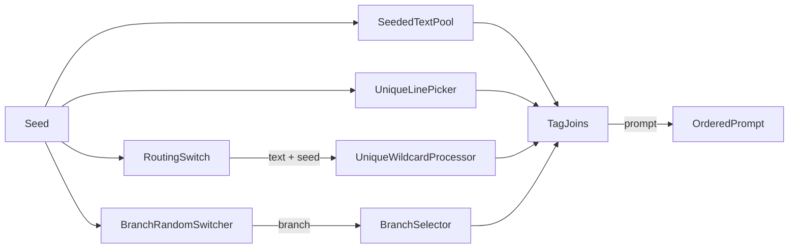

# Dynamic Prompt Engine

ComfyUI custom nodes for modular, seed-reproducible prompt building. Editable
multiline pools, Unique Line Picker, Unique Wildcard Processor, a weighted
routing switch with dynamic inputs, a seeded random branch switcher, an N-way
branch selector, and Tag Join.

Clone directly into `ComfyUI/custom_nodes/` -- no symlinks or copying needed.

## Breaking Change

The branch-node replacement is not backward compatible with saved workflows. The
following legacy nodes were removed and are no longer registered:

- `BranchToggle`
- `FirstOrMerge`
- `FirstOrSecond`

Workflows containing these nodes must be rebuilt manually using `BranchRandomSwitcher`
and `BranchSelector`. Their old socket layouts and links are not migrated automatically.
`FirstOrMerge` also had branch-specific merge behavior that has no direct equivalent in
the generic selector; reproduce that behavior with the appropriate `Tag Join` nodes.

These mapping keys also changed (not migrated automatically):

- `SeededLinePicker` → `UniqueLinePicker`
- `WildcardProcessor` → `UniqueWildcardProcessor`

## Architecture



**Seeded** nodes (**Seeded Text Pool**, **Unique Line Picker**, **Routing Switch**, **Branch Random Switcher**, **Unique Wildcard Processor**) accept `seed` for deterministic selection. **Branch Selector** and **Tag Join** do not use seed.

Empty or whitespace-only STRING inputs are skipped on join. Tag-like joins strip leading/trailing `,` and spaces from each part, then join with ", " and end with ", " when non-empty.

## Custom nodes

Category: **Dynamic Prompt Engine**

| Node | Required inputs | Optional inputs | Outputs |
|------|----------------|-----------------|---------|
| **Seeded Text Pool** | `pool_text`, `bypass_chance`, `seed` | -- | `text`, `seed` |
| **Unique Line Picker** | `input`, `bypass_chance`, `seed` | -- | `text`, `seed` |
| **Routing Switch** | `seed` | dynamic `input_0`... plus `chance_N` combos | `text`, `seed` |
| **Branch Random Switcher** | `seed` | `branch_0`...`branch_14` | `text`, `branch` |
| **Branch Selector** | `branch` | `input_0`...`input_14` | `text` |
| **Tag Join** | `text` preview | dynamic `tag_0`... | `prompt` |
| **Unique Wildcard Processor** | `populated_text`, `seed` | -- | `processed text` |
| **CLIP Token Report** | `clip`, `text` (socket) | `report` preview | `report` |
| **Resolution Switch** | `resolution`, `batch_size`, `clip_scale` | -- | `width`, `height`, `latent`, `scaled_width`, `scaled_height` |

### Seeded Text Pool

Picks one line from `pool_text`. Choice is `hash(seed:node:{id}) % n`, so two copies of this node with the same seed can still pick different lines. Unlike **Unique Line Picker**, this node expands Impact `{a|b}` / `__wildcard__` on the chosen line, and its bypass gate is `hash % 2` rather than PCG64. Outputs `text` and passes `seed` through unchanged.

- Candidates: split on newlines, strip, drop blank/whitespace lines.
- `bypass_chance` **Off**: never gates. **50%**: `hash(seed:node:{id}:gate) % 2 == 0` returns empty text (runs even if the pool is empty).
- Literal line `[empty]` is a candidate that emits `""`.
- Impact Pack `{a|b}` / `__wildcard__` runs only on the chosen line and requires ComfyUI-Impact-Pack.

Examples:

- `alice\nbob\ncharlie` → one of those three, stable for the same seed+node.
- `alice\n\n  \nbob` → only alice and bob are candidates.
- Empty pool, or bypass gate even → `""`.

### Unique Line Picker

Picks one line from a **socket-only** `input` STRING (wire another STRING in; no text widget). Unlike **Seeded Text Pool**, there is no multiline box, and `{a|b}` / `__wildcard__` are not expanded. ComfyUI's per-node `unique_id` is mixed into the seed, then `np.random.default_rng(stream_seed).integers(0, n)` chooses the line (same PCG64 generator Impact uses). Two copies of this node with the same seed can still pick different lines. Outputs `text` and passes `seed` through unchanged.

- Candidates: split on newlines, strip, drop blank/whitespace lines.
- `bypass_chance` **Off**: never gates. **50%**: `default_rng(hash(seed:node:{id}:gate)).integers(0, 2) == 0` returns empty text (same PCG64 `integers()` as the line pick; runs even if the pool is empty).
- Literal line `[empty]` is a candidate that emits `""`.
- `{a|b}` / `__wildcard__` are **not** expanded.

Examples:

- `alice\nbob\ncharlie` → one of those three, stable for the same seed+node.
- Two copies of this node, same seed, different node ids → independent winners.
- `alice\n\n  \nbob` → only alice and bob are candidates.
- Empty pool, or bypass gate 0 → `""`.

### Routing Switch

Seeded weighted pick among uncapped dynamic `input_0`... STRING sockets (Tag Join grow-by-one-spare). Sockets use ComfyUI’s default spacing. Connected sockets get a combo in a block under the inputs (**Default**, **Off**, **1.5x**, **2x**; Default is 1×), labeled with the same name as that input. Unconnected spare sockets have no combo. Seed and Control after generate sit at the bottom.

A slot enters the lottery only if it is wired (the `input_N` value is present and not `None`) and the combo is not Off. A wired empty or whitespace string is a real candidate and can win as `""`. Missing combo counts as Default. Integer weights: Default = 2, 1.5x = 3, 2x = 4. Pick is `hash(seed:node:{id}) % total_weight`.

Outputs the winning string (stripped, no trailing comma) and the same `seed` so you can wire **Unique Wildcard Processor** (or Impact Pack) yourself.

- Unconnected (`None` / omitted) and Off are excluded. Off does not add weight.
- Connected empty/whitespace can win; output is `""`.
- Zero eligible → `text=""`, seed still passed through.
- Same seed + node id + wiring + combos → same winner.

Examples:

- Three Default clothes groups → one of them, equal chance.
- `input_0` Default and `input_1` 2x → `input_1` wins about twice as often.
- Wired empty Default plus a non-empty Default → either `""` or the text, equal chance.
- Only Off or unconnected left → empty text.

### Branch Random Switcher

Seeded pick among wired `branch_0`...`branch_14` sockets (max 15). Outputs `text` and `branch` (the **socket index**, not "Nth wire"). Unplug a socket to drop it from the rotation. A wired empty string still counts as connected.

```text
connected = sorted indices of wired branch_N inputs
```

- **0 wired** → `text` is `""`; `branch = hash(seed:node:{id}) % 2` (0 or 1).
- **1 wired** → `branch` is that socket's index (only `branch_5` → always 5); `text` is that value after comma hygiene.
- **2+ wired** → seeded pick among those indices; `text` is the chosen value after comma hygiene (strip empty/whitespace, strip extra commas, join with `", "` and a trailing `", "` when non-empty).

Examples:

- `branch_0=red`, `branch_1=blue`, `branch_2=green` → `branch` is 0, 1, or 2; `text` is `"red, "` / `"blue, "` / `"green, "`.
- Only `branch_5` wired → always `branch=5`.
- `branch_2` wired to `""` and picked → `text=""`, `branch=2` (selector passes `""` through if `input_2` is also wired).
- Nothing wired → `text=""` and `branch` 0 or 1, so a selector may return `branch 1 skipped` if `input_1` is unwired.

Match selector `input_N` to switcher `branch_N`.

### Branch Selector

Returns `input_{branch}` (`input_0`...`input_14`). The integer is a socket index. No seed. `branch` must be 0...14 (otherwise raises).

- Socket **unwired** → `"branch {n} skipped"` (e.g. `branch 2 skipped`).
- Socket **wired** to empty/whitespace → `""` passed through (Tag Join drops it).
- Socket **wired** to text → that string, whitespace-stripped.

Examples:

- `branch=1`, `input_1=bob` → `"bob"`.
- Switcher has 3 branches, selector only `input_0` and `input_1`, pick 2 → `"branch 2 skipped"`.
- `input_2` wired to `""` → `""`.

`"branch N skipped"` is real text; Tag Join will include it if you wire this output into a join.

### Tag Join

Joins wired `tag_N` strings in numeric index order (`tag_10` after `tag_2`). Dynamic sockets: connected tags + one spare. No seed. The multiline `text` widget is a preview only (filled after run), not a tag input. Output: `prompt`.

- Skip empty/whitespace tags; strip leading/trailing commas and spaces; skip again if nothing remains.
- Join survivors with `", "` and add a trailing `", "` when non-empty. All empty → `""`.

Examples:

- `tag_0=red`, `tag_1=blue` → `"red, blue, "`.
- `tag_0=""`, `tag_1=blue` → `"blue, "`.
- `tag_0=red,`, `tag_1=, blue` → `"red, blue, "`.
- `tag_0` and `tag_2` wired, `tag_1` empty/unwired → join 0 then 2.

A selector marker like `branch 2 skipped` is non-empty, so it is included in the prompt.

### Unique Wildcard Processor

Expands Impact Pack `{a|b}` / `__wildcard__` syntax in `populated_text` and outputs `processed text`. Unlike **Unique Line Picker**, this node does expand Impact syntax. Always expands at execute (populate behavior). Type in the multiline widget or convert/wire another STRING into it; the widget is not overwritten.

- Requires **ComfyUI-Impact-Pack** when the text contains `{` or `__` (raises if missing).
- Plain text with neither is returned unchanged.
- ComfyUI's per-node `unique_id` is mixed into the seed, then Impact `process(populated_text, stream_seed)` expands. Two copies of this node with the same seed can still expand differently. Same seed + same node stays deterministic.

Examples:

- `a {red|blue} fox` + seed → `a red fox` or `a blue fox`.
- Two copies of this node, same seed, different node ids → independent expansions.
- Wire Tag Join / Routing Switch into `populated_text` → output is the expanded prompt.

### CLIP Token Report

Inspect-only node: tokenizes the prompt with ComfyUI's connected CLIP via `clip.tokenize(text)` and shows how the encoder splits it into fixed windows. Does **not** output conditioning — keep using stock **CLIPTextEncode** for that. Wire the **same CLIP** and **same prompt** you encode with.

**Layout:** `text` is a socket input (wire from Tag Join or upstream). The multiline **report** widget on the node is a read-only preview filled after queue/run, matching the Tag Join pattern.

For SDXL / Illustrious XL, CLIP-L and CLIP-G each use a **77-token window**: 1 BOS + **75 content** + 1 EOS + padding. When both encoders chunk identically (normal prompts), the report shows one **CLIP-L / CLIP-G** section instead of duplicating the same breakdown.

- **On-node preview**: multiline `report` widget (filled after queue/run).
- **STRING output**: same formatted report for Show Text or downstream nodes.
- **Overflow**: `overflow: yes` when total content tokens exceed 75 (multiple chunks).
- **Textual inversions**: non-integer token slots appear as `[embedding]` in reconstructed text.

Example report excerpt:

```text
CLIP-L / CLIP-G  window 77, content capacity 75
chunks: 2    content tokens: 80    overflow: yes

[chunk 1/2]  75/75
first chunk reconstructed text...

[chunk 2/2]  5/75
remaining reconstructed text...
```

### Resolution Switch

Picks width/height from a preset (`W x H (ratio)`), builds an empty latent `[batch_size, 4, height/8, width/8]`, and outputs CLIP-scaled sizes `int(dimension * clip_scale)`.

Examples: 1024×1024 with `clip_scale=2` → scaled 2048×2048. Scaled sizes truncate to int.

### Seeding summary

| Feature | Mechanism |
|---------|-----------|
| Pool choice | `hash(seed:node:{id}) % n` |
| Unique Line Picker | PCG64 `integers(0, n)` seeded from `hash(seed:node:{id})` |
| Bypass chance gate (Seeded Text Pool) | `hash(seed:node:{id}:gate) % 2` |
| Bypass chance gate (Unique Line Picker) | PCG64 `integers(0, 2)` seeded from `hash(seed:node:{id}:gate)` |
| Routing switch | weighted pick among eligible `input_N` slots |
| Branch random switch | seeded pick among connected branch indices |
| Branch selector | direct index lookup (no seed) |
| Unique Wildcard Processor | `hash(seed:node:{id})` then Impact `process(populated_text, stream_seed)` |
| Seed chain | passthrough INT on Seeded Text Pool, Unique Line Picker, and Routing Switch |

## Install

```bash
cd ComfyUI/custom_nodes/
git clone https://github.com/Cueuler/dynamic_prompt_engine.git
```

Restart ComfyUI.
