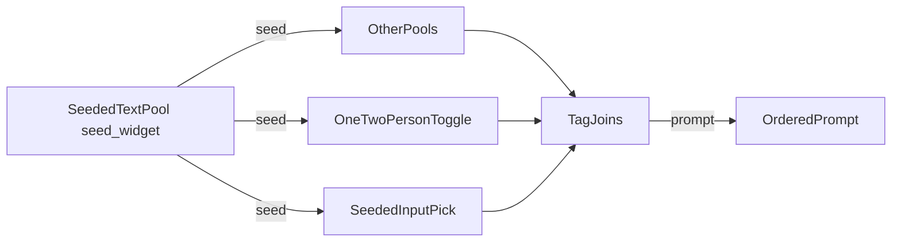

# Dynamic Prompt Engine

ComfyUI custom nodes for modular, seed-reproducible prompt building. Editable multiline pools, dynamic picks, and a readable one/two-person toggle replace a monolithic Impact Pack wildcard string.

## Architecture



**Seeded** nodes (**Seeded Text Pool**, **Seeded Input Pick**, **One/Two Person Toggle**) accept `seed` and output the same `seed` so you can fan-out or daisy-chain. Set the numeric seed on the first pool; link its `seed` output into the rest.

**Tag Join** and **Text Pool Router** do not use seed.

Empty or whitespace-only STRING inputs are ignored on every node. Tag-like joins also strip leading/trailing `,` and spaces from each part, then join with `", "` and end the result with `", "` when non-empty.

## Custom nodes

Package: [`custom_nodes/dynamic_prompt_engine/`](custom_nodes/dynamic_prompt_engine/)  
Category: **Dynamic Prompt Engine**

| Node | Inputs | Outputs |
|------|--------|---------|
| **Seeded Text Pool** | `pool_text`, `bypass_chance`, `seed` | `text`, `seed` |
| **Seeded Input Pick** | dynamic `pick_0`…, `seed` | `text`, `seed` |
| **One/Two Person Toggle** | `one_label`, `two_label`, `seed`, `one_character`, `two_or_more_characters` | `text`, `seed` |
| **Tag Join** | `text` preview, dynamic `tag_0`… | `prompt` |
| **Text Pool Router** *(legacy)* | `index`, dynamic `input_0`… | `text` |

### Seeded Text Pool

- Candidates: one non-empty line per entry in `pool_text` (`[empty]` emits an empty string).
- Choice: `hash(seed:node:{id}) % line_count` (independent stream per node instance).
- Supports Impact Pack `{a\|b}` / `__wildcard__` expansion on the chosen line.
- `bypass_chance` **50%**: half the time emits empty via a separate `…:gate` hash; **Off** never gates.
- Passes `seed` through unchanged.

### Seeded Input Pick

- Collects non-empty linked `pick_N` strings (numeric order).
- Choice: `hash(seed:node:{id}) % candidate_count`.
- Passes `seed` through unchanged.

### One/Two Person Toggle

Seed-based switch between a solo branch and a multi-person branch.

| Input | Role |
|-------|------|
| `one_label` | Solo prefix (default `1girl`) |
| `two_label` | Multi prefix (default `2girls`) |
| `one_character` | Linked body/block for solo |
| `two_or_more_characters` | Linked body/block for multi |
| `seed` | Picks the branch; also passed through |

```text
choice = hash(seed:one_two_person_toggle) % 2
```

- `0` → `join(one_label, one_character)`
- `1` → `join(two_label, two_or_more_characters)`

The stream key is **fixed** (`one_two_person_toggle`), so every toggle with the same seed picks the same branch (keeps composition and character gates aligned). Empty parts are skipped; output uses the same `", "` hygiene as Tag Join.

### Tag Join

- Concatenates connected `tag_N` strings in numeric order (dynamic sockets: connected tags + one spare).
- Always shows a multiline `text` preview (placeholder until run; filled with the joined prompt after execution; not used as a tag input).
- No seed input/output.
- Output is the joined `prompt` string.

### Text Pool Router *(legacy)*

- Selects `input_N` by integer `index` (`0` → `input_0`, …). Falls back to the first non-empty input if the chosen slot is empty.
- Prefer **Seeded Input Pick** or **One/Two Person Toggle** for new graphs.
- No seed input/output.

### Seeding summary

| Feature | Mechanism |
|---------|-----------|
| Pool / pick choice | `hash(seed:node:{id}) % n` |
| Bypass chance gate | `hash(seed:node:{id}:gate) % 2` |
| One/two person section | `hash(seed:one_two_person_toggle) % 2` (shared across toggles) |
| Seed chain | passthrough INT on seeded nodes only |

## Install

1. Copy or symlink `custom_nodes/dynamic_prompt_engine` into ComfyUI’s `custom_nodes/`.
2. Restart ComfyUI.

## Dev helpers

```bash
python build_workflows.py
python test_prompt_engine.py
```
