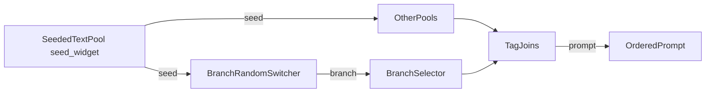

# Dynamic Prompt Engine

ComfyUI custom nodes for modular, seed-reproducible prompt building. Editable multiline pools, a seeded random branch switcher with dynamic inputs, and an N-way branch selector.

Clone directly into `ComfyUI/custom_nodes/` -- no symlinks or copying needed.

## Architecture



**Seeded** nodes (**Seeded Text Pool**, **Branch Random Switcher**) accept `seed` for deterministic selection. **Branch Selector** and **Tag Join** do not use seed.

Empty or whitespace-only STRING inputs are skipped on join. Tag-like joins strip leading/trailing `,` and spaces from each part, then join with ", " and end with ", " when non-empty.

## Custom nodes

Category: **Dynamic Prompt Engine**

| Node | Required inputs | Optional inputs | Outputs |
|------|----------------|-----------------|---------|
| **Seeded Text Pool** | `pool_text`, `bypass_chance`, `seed` | -- | `text`, `seed` |
| **Branch Random Switcher** | `seed` | `branch_0`...`branch_14` | `text`, `branch` |
| **Branch Selector** | `branch` | `input_0`...`input_14` | `text` |
| **Tag Join** | `text` preview | dynamic `tag_0`... | `prompt` |

### Seeded Text Pool

- Candidates: one non-empty line per entry in `pool_text` (`[empty]` emits an empty string).
- Choice: `hash(seed:node:{id}) % line_count` (independent stream per node instance).
- Supports Impact Pack `{a|b}` / `__wildcard__` expansion on the chosen line.
- `bypass_chance` **50%**: half the time emits empty via a separate `...:gate` hash; **Off** never gates.
- Passes `seed` through unchanged.

### Branch Random Switcher

Seeded random switch over up to 15 dynamic inputs (`branch_0`...`branch_14`). The rotation is the set of connected inputs — unplug a socket to remove it, or wire a single input to always return it.

```text
connected = sorted indices of wired branch_N inputs
```

- **0 connected** → `branch = hash(seed:node:{id}) % 2` (0 or 1); `text` is empty.
- **1 connected** → `branch = that index`; `text` is that input's value.
- **2+ connected** → `branch` is a seeded pick from the connected set; `text` is that input's value.

Outputs `text` and the chosen `branch` index (0...14). Wire `branch` into **Branch Selector** for section routing.

### Branch Selector

N-way selector: returns the value of `input_{branch}` (dynamic inputs `input_0`...`input_14`). An index with no connected input returns an empty string (Tag Join skips it). `branch` must be 0...14.

### Tag Join

- Concatenates connected `tag_N` strings in numeric order (dynamic sockets: connected tags + one spare).
- Always shows a multiline `text` preview (placeholder until run; filled after execution).
- No seed input/output.
- Output is the joined `prompt` string.

### Seeding summary

| Feature | Mechanism |
|---------|-----------|
| Pool choice | `hash(seed:node:{id}) % n` |
| Bypass chance gate | `hash(seed:node:{id}:gate) % 2` |
| Branch random switch | seeded pick among connected branch indices |
| Branch selector | direct index lookup (no seed) |
| Seed chain | passthrough INT on Seeded Text Pool only |

## Install

```bash
cd ComfyUI/custom_nodes/
git clone https://github.com/Cueuler/dynamic_prompt_engine.git
```

Restart ComfyUI.