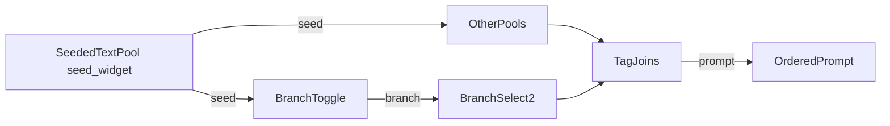

# Dynamic Prompt Engine

ComfyUI custom nodes for modular, seed-reproducible prompt building. Editable multiline pools, a branch toggle for 1girl/2girls composition, and fixed 2-way section switches.

## Architecture



**Seeded** nodes (**Seeded Text Pool**, **Branch Toggle**) accept `seed` and output the same `seed` so you can fan-out or daisy-chain.

**Tag Join** and **Branch Select 2** do not use seed.

Empty or whitespace-only STRING inputs are skipped on Tag Join. Tag-like joins strip leading/trailing `,` and spaces from each part, then join with `", "` and end with `", "` when non-empty.

## Custom nodes

Package: [`custom_nodes/dynamic_prompt_engine/`](custom_nodes/dynamic_prompt_engine/)  
Category: **Dynamic Prompt Engine**

| Node | Inputs | Outputs |
|------|--------|---------|
| **Seeded Text Pool** | `pool_text`, `bypass_chance`, `seed` | `text`, `seed` |
| **Branch Toggle** | `mode`, `seed`, `branch_1`, `branch_2` | `text`, `seed`, `branch` |
| **Branch Select 2** | `branch`, `solo`, `duo` | `text` |
| **Tag Join** | `text` preview, dynamic `tag_0`… | `prompt` |

### Seeded Text Pool

- Candidates: one non-empty line per entry in `pool_text` (`[empty]` emits an empty string).
- Choice: `hash(seed:node:{id}) % line_count` (independent stream per node instance).
- Supports Impact Pack `{a\|b}` / `__wildcard__` expansion on the chosen line.
- `bypass_chance` **50%**: half the time emits empty via a separate `…:gate` hash; **Off** never gates.
- Passes `seed` through unchanged.

### Branch Toggle

Mode-controlled switch between a solo branch and a multi-person branch.

| Input | Role |
|-------|------|
| `mode` | `Random` / `1girl` / `2girls` |
| `branch_1` | Linked text always used (e.g. character 1) |
| `branch_2` | Linked text used on duo branch (e.g. character 2) |
| `seed` | Used when `mode` is Random; also passed through |

```text
choice = hash(seed:one_two_person_toggle) % 2
```

- `0` → `join(1girl, branch_1)`
- `1` → `join(2girls, branch_1, branch_2)`

Wire `branch` into **Branch Select 2** for interaction/Char2 sections. Empty `branch_1` / `branch_2` fail validation even on the 1girl path.

### Branch Select 2

Fixed 2-way switch: `branch` 0 → `solo`, 1 → `duo`. Empty selected path returns empty (Tag Join skips it). Use solo blank + duo = Char2 section to omit Char2 when branch is 0.

### Tag Join

- Concatenates connected `tag_N` strings in numeric order (dynamic sockets: connected tags + one spare).
- Always shows a multiline `text` preview (placeholder until run; filled after execution).
- No seed input/output.
- Output is the joined `prompt` string.

### Seeding summary

| Feature | Mechanism |
|---------|-----------|
| Pool choice | `hash(seed:node:{id}) % n` |
| Bypass chance gate | `hash(seed:node:{id}:gate) % 2` |
| Branch toggle | `hash(seed:one_two_person_toggle) % 2` (shared) |
| Seed chain | passthrough INT on seeded nodes only |

## Install

1. Copy or symlink `custom_nodes/dynamic_prompt_engine` into ComfyUI’s `custom_nodes/`.
2. Restart ComfyUI.

## Dev helpers

```bash
python -m pytest custom_nodes/dynamic_prompt_engine/tests -q
```
