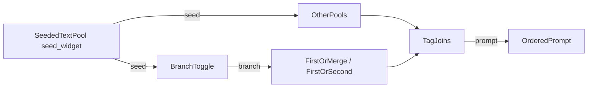

# Dynamic Prompt Engine

ComfyUI custom nodes for modular, seed-reproducible prompt building. Editable multiline pools, a branch toggle for 1girl/2girls composition, and fixed 2-way section switches.

Clone directly into `ComfyUI/custom_nodes/` -- no symlinks or copying needed.

## Architecture



**Seeded** nodes (**Seeded Text Pool**, **Branch Toggle**) accept `seed` and output the same `seed` so you can fan-out or daisy-chain. **First Or Merge**, **First Or Second**, and **Tag Join** do not use seed.

Empty or whitespace-only STRING inputs are skipped on merge/join. Tag-like joins strip leading/trailing `,` and spaces from each part, then join with ", " and end with ", " when non-empty.

## Custom nodes

Category: **Dynamic Prompt Engine**

| Node | Required inputs | Optional inputs | Outputs |
|------|----------------|-----------------|---------|
| **Seeded Text Pool** | `pool_text`, `bypass_chance`, `seed` | -- | `text`, `seed` |
| **Branch Toggle** | `mode`, `seed` | `branch_1`, `branch_2` | `text`, `seed`, `branch` |
| **First Or Merge** | `branch` | `solo`, `duo` | `text` |
| **First Or Second** | `branch` | `solo`, `duo` | `text` |
| **Tag Join** | `text` preview | dynamic `tag_0`... | `prompt` |

### Seeded Text Pool

- Candidates: one non-empty line per entry in `pool_text` (`[empty]` emits an empty string).
- Choice: `hash(seed:node:{id}) % line_count` (independent stream per node instance).
- Supports Impact Pack `{a|b}` / `__wildcard__` expansion on the chosen line.
- `bypass_chance` **50%**: half the time emits empty via a separate `...:gate` hash; **Off** never gates.
- Passes `seed` through unchanged.

### Branch Toggle

Mode-controlled switch between a solo branch and a multi-person branch.

| Input | Role |
|-------|------|
| `mode` | `Random` / `1girl` / `2girls` |
| `seed` | Used when `mode` is Random; also passed through |
| `branch_1` (optional) | Text used when branch = 0 (e.g. character 1) |
| `branch_2` (optional) | Text used when branch = 1 (e.g. character 2) |

```text
choice = hash(seed:one_two_person_toggle) % 2
```

- `0` -> outputs `branch_1`
- `1` -> outputs `branch_2`

Wire `branch` into **First Or Merge** / **First Or Second** for section routing. Optional inputs left disconnected or empty produce empty output.

### First Or Merge

Routes `branch` from BranchToggle: `0` -> solo only; `1` -> `join_prompt_parts(solo, duo)`. Empty inputs are skipped on merge -- leave solo blank and wire Char2 into duo to omit Char2 when branch is 0 and include it when branch is 1.

### First Or Second

Routes `branch` from BranchToggle: `0` -> solo only; `1` -> duo only. Empty selected path returns empty (Tag Join skips it). Use solo blank + duo = Char2 section to omit Char2 when branch is 0.

### Tag Join

- Concatenates connected `tag_N` strings in numeric order (dynamic sockets: connected tags + one spare).
- Always shows a multiline `text` preview (placeholder until run; filled after execution).
- No seed input/output.
- Output is the joined `prompt` string.

### Seeding summary

| Feature | Mechanism |
|---------|-----------|
| Pool choice | `hash(seed:node:{id}) % n` |
| Bypass chance gate | `hash(seed:node:{id}:gate) % 2` |
| Branch toggle | `hash(seed:one_two_person_toggle) % 2` (shared) |
| Seed chain | passthrough INT on seeded nodes only |

## Install

```bash
cd ComfyUI/custom_nodes/
git clone https://github.com/Cueuler/dynamic_prompt_engine.git
```

Restart ComfyUI.
